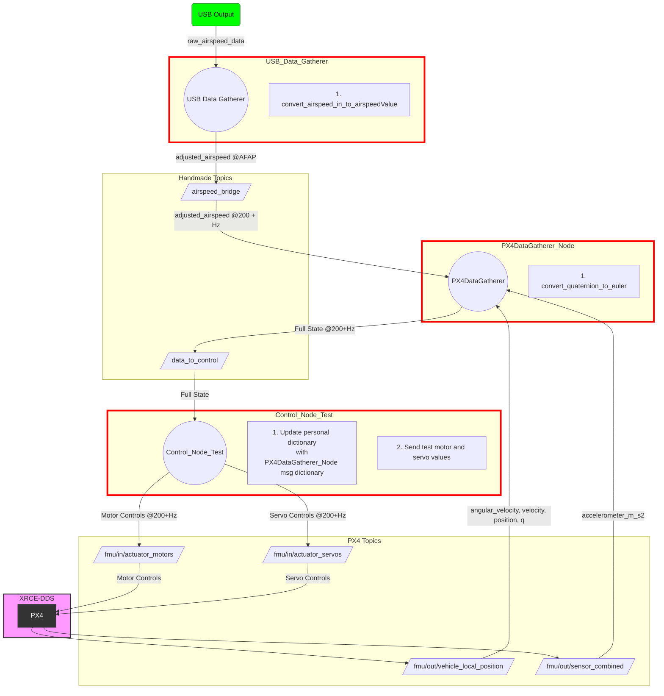

# vtol_ctrl_ros2

## Reading the README.md

### Disclaimer

This tutorial expects that the user (you) is (are) using VSCode to edit code and view the text. For GitHub or other sources, please adapt the startup instructions as needed. 

This tutorial also expects you are familiar with:
- Github & Git Commands
- Python
- MAGICC Lab Resources (Github, Gitlab)
- MAGICC Lab Projects (ROSFlight, PX4, etc.)

###

1. This Markdown Preview utilizes Mermaid and LaTeX in its setup so ROS graphs can be quickly and directly be altered later. Download the ```Markdown Preview Mermaid Support``` and the `Markdown+Math` extensions.
2. This code relies on an altered fork of PX4-Autopilot. A guide to building on that repository is found in this repo, under "Making a Private Clone of a Public Repo.pdf".

### Using PX4 Clone

 This project's usage of the public repo differ in two ways from the instructions in ```Making a Private Clone of a Public Repo.pdf```:
 
1. The main branch of PX4/PX4-Autopilot is actually "main", and not "master".
2. This project uses a public copy of the repository, and not a private one.

The clone of PX4/PX4-Autopilot will differ in, at most, 5 ways:

1. The ```src/modules/uxrce_dds_client/dds_topice.yaml``` file includes other PX4 topics being published, which capability, as of August 28, PX4 added to their documentation,
2. The ```README.md``` will only reflect the needs of my version of the project; the original will be deleted.
3. If proven possible, uORB topics will be altered such that $\alpha$ (angle of attack) and multiple other airspeed sensors can be read by the Pixhawk.
4. The ```Making a Private Clone of a Public Repo.pdf``` is added (credit to BYU for making the presentation).
5. The instructions on said pdf for pulling and upstreaming must be done every time one would normally git pull (which is every day before the start of working).
## Running the code
### Start the Agent
For ROS 2 to communicate with PX4, uXRCE-DDS client must be running on PX4, connected to a micro XRCE-DDS agent running on the companion computer.

The agent can be installed onto the companion computer in a number of ways. Below we show how to build the agent "standalone" from source and connect to a client running on the PX4 simulator.

To setup and start the agent:

    Open a terminal.
Enter the following commands to fetch and build the agent from source:
```bash
git clone https://github.com/eProsima/Micro-XRCE-DDS-Agent.git
cd Micro-XRCE-DDS-Agent
mkdir build
cd build
cmake ..
make
sudo make install
sudo ldconfig /usr/local/lib/
```

1. The above is as described in https://docs.px4.io/main/en/ros2/user_guide.html. Enter the following now to start the "XRCE-DDS" agent (aka the "Mircro-ROS" agent) with settings for connecting to the uXRCE-DDS client running on the simulator:
```
MicroXRCEAgent udp4 -p 8888
``` 
#### For USB:

Plug in and unplug your USB Connection.

Open a new terminal.

Use the following to check which USB port to [check which connection was just plugged in](https://www.cyberciti.biz/faq/find-out-linux-serial-ports-with-setserial/):
```
sudo dmesg | grep tty
```

Then:


```
$ MicroXRCEAgent serial -b 57600 --dev /dev/ttyUSB0
```
Replace ```57600``` with the appropriate baud rate. ```921600``` is just the standard. The baud rate should be ```57600``` for MAGICC Lab PX4 work. 

Replace ```ttyUSB0``` with the appropriate port.

2. Start a terminal. On Linux, this can be accomplished via the `Ctrl-Alt-t` keystroke sequence. In that new termianl, start the latest PX4 Gazebo simulation of preference as described in https://docs.px4.io/main/en/sim_gazebo_gz/. 

3. Start up QGroundControl, which should connect automatically to the PX4 Gazebo Simulation.

4. Open a new terminal for the ROS 2 source code. For each successive node started, a new terminal will be needed, and steps 1-4 below will need to be repeated for each.

### Running the ROS code.
This will utilize the terminal above.

0. Make sure ROS 2 is completely installed. For our purposes, the installation instructions on PX4's website will do:
```
https://docs.px4.io/main/en/ros2/user_guide.html
```
Then:

1.  
```
cd ~/vtol_ctrl_ros2
```
2. Source the ROS 2 setup. WARNING: Please do this on Ubuntu 22.04 (the one with the jellyfish. For the Hackathon 2024, that's what the RPi has).
```
source /opt/ros/humble/setup.bash
```
Explanation for this is found at:
```
https://docs.ros.org/en/humble/Tutorials/Beginner-CLI-Tools/Configuring-ROS2-Environment.html
```
3. Source the install package; all the stuff is already set up.
```
source install/local_setup.bash
```
4. 
To use a certain node, run:
```
ros2 run <package-name> <package-node>
```
Examples include:

```
ros2 run ros2_px4_interface offboard_test
```
or:
```
ros2 run ros2_px4_interface ros2_px4_interface
```
or multiple nodes (_launch file to do this same task is not yet written_):
```
ros2 run ros2_px4_interface usb_data_gatherer ros_mavsim_wrapper
```

You can run multiple ROS nodes in different terminals. Make sure in each terminal, you source ROS and the install as described above.


NOTE: if you are going to alter the nodes, you need to update the package:
```
colcon build --packages-select ros2_px4_interface
```

The ```px4_ros_com``` and ```px4_msgs``` are provided by PX4 and should not be altered.

## Adding new nodes

If you are going to write a new node, follow the instructions found at Steps 2 on: 

https://docs.ros.org/en/humble/Tutorials/Beginner-Client-Libraries/Writing-A-Simple-Py-Publisher-And-Subscriber.html


# Design Description

#### The full state needed:
##### Important note: The timestamp of the pixhawk is in [MICROseconds](https://docs.px4.io/main/en/msg_docs/VehicleAttitude.html#:~:text=system%20start%20(-,microseconds,-)%0A%0Auint64%20timestamp_sample).
| Abbreviation         | Name             | Frame Needed     | PX4/DDS Topic                                                                                                 | Given Frame in PX4/DDS Topic                                                                                                                                                                           | Needed Variable                                                                                                                   |
|----------------------|------------------|------------------|---------------------------------------------------------------------------------------------------------------|---------------------------------------------------------------------------------------------------------------------------------------------------------------------------------------------------|-----------------------------------------------------------------------------------------------------------------------------------|
| Va                   | Airspeed         | --               | [AirspeedWind](https://github.com/PX4/px4_msgs/blob/main/msg/AirspeedWind.msg)(must be added manually.Possible as of August 28, 2024). See also [Airspeed](https://github.com/PX4/px4_msgs/blob/main/msg/Airspeed.msg)                                        | --                                                                                                                                                                                                | --                                                                                                                               |
| p,q,r                | Angular Velocity | Body             | [VehicleOdometry](https://docs.px4.io/main/en/msg_docs/VehicleOdometry.html)                                  | Body.<br> See [Angular Velocity Documentation](https://docs.px4.io/main/en/msg_docs/VehicleOdometry.html#:~:text=float32%5B3%5D%20angular_velocity).   | float32[3] angular_velocity<br>**Angular velocity in body-fixed frame (rad/s). NaN if invalid/unknown**                        |
| Vx, Vy, Vz           | Velocity         | Inertial         | [VehicleOdometry](https://docs.px4.io/main/en/msg_docs/VehicleOdometry.html).<br> Also available in [VehicleLocalPosition](https://docs.px4.io/main/en/msg_docs/VehicleLocalPosition.html) | Inertial or Body.<br> See [Velocity Documentation](https://docs.px4.io/main/en/msg_docs/VehicleOdometry.html#:~:text=uint8%20VELOCITY_FRAME_UNKNOWN%20%20%3D,invalid/unknown) | float32[3] velocity<br>**Velocity in meters/sec. Frame of reference defined by velocity_frame variable. NaN if invalid/unknown** |
| $\alpha$             | Angle of Attack  | --               | (not available currently; need to create ROS Node to calculate this)                                          | --                                                                                                                                                                                                | --                                                                                                                               |
| $\beta$              | Sideslip Angle   | --               | [AirspeedWind](https://github.com/PX4/px4_msgs/blob/main/msg/AirspeedWind.msg) (must be added manually. Possible as of August 28, 2024)                                          | --                                                                                                                                                                                                | --                                                                                                                               |
| Px, Py, Pz           | Position         | Inertial         | [VehicleOdometry](https://docs.px4.io/main/en/msg_docs/VehicleOdometry.html).<br> Also available in [VehicleLocalPosition](https://docs.px4.io/main/en/msg_docs/VehicleLocalPosition.html) | Inertial.<br> NOTE: Needed to calculate roll, pitch and yaw ($\phi$, $\theta$, $\psi$) from Quaternion. May also have roll, pitch and yaw ($\phi$, $\theta$, $\psi$) in other topic.<br> See [Position Documentation](https://docs.px4.io/main/en/msg_docs/VehicleOdometry.html#:~:text=uint8%20POSE_FRAME_UNKNOWN%20%3D%200%0Auint8%20POSE_FRAME_NED,value%20NaN%20if%20invalid/unknown) | float32[3] position<br>**Position in meters. Frame of reference defined by local_frame. NaN if invalid/unknown**             |
| Ax, Ay, Az           | Acceleration     | Inertial         | [SensorCombined](https://docs.px4.io/main/en/msg_docs/SensorCombined.html)                                   | Inertial.<br> See [Acceleration Documentation](https://docs.px4.io/main/en/msg_docs/SensorCombined.html#:~:text=int32%20accelerometer_timestamp_relative%20%20%23%20timestamp,period%20in%20microseconds) | float32[3] accelerometer_m_s2<br>**Average value acceleration measured in the FRD body frame XYZ-axis in m/s²**                  |
| $\phi$, $\theta$, $\psi$ | Attitude         | Vehicle          | (Can be calculated from quaternion in [VehicleOdometry](https://docs.px4.io/main/en/msg_docs/VehicleOdometry.html)). See also [VehicleAttidue](https://github.com/PX4/px4_msgs/blob/main/msg/VehicleAttitude.msg) for another copy of the | --                                                                                                                                                                                                | float32[4] q<br>**Quaternion rotation from FRD body frame to reference frame. First value NaN if invalid/unknown**             |


The needed calculation will be performed in real time from [example code found on Wikipedia and converted to Python code.](https://en.wikipedia.org/wiki/Conversion_between_quaternions_and_Euler_angles#:~:text=%23define%20_USE_MATH_DEFINES%0A%23include,angles%3B%0A%7D) This calculation will be included in the subscriber function found in the px4_data_gatherer.py function.


#### Implementation Version of Code:


```mermaid
graph TD

    subgraph PX4 Topics
        D2[/fmu/in/actuator_servos/]
        D1[/fmu/in/actuator_motors/]
        D[/fmu/out/vehicle_local_position/]
        E[/fmu/out/sensor_combined/]
        F[/airspeed_usb_data/]
        FF2[/fmu/out/airspeed_wind/]
    end

    H -->|Motor Control<br> @100+Hz| D1
    H --> |Servo Controls<br> @100+Hz|D2
    D1 -->|Motor Controls|PX4
    D2 -->|Servo Controls|PX4

    subgraph "USB_Data_Gatherer_x_?"
        G((USB_Data_Gatherer))
        A2[1. convert_airspeed_in_to_airspeedValue]
       
    end

    USB(USB Output)
    USB -->|raw_airspeed_data| G

    subgraph XRCE-DDS
        PX4[PX4]
        PX4 --> D
        PX4 --> E
        PX4 --> FF2
    end

    subgraph Control_Node
        H((ROS_Wrapper))
        H2[1. Update personal dictionary<br> with data from all subscriptions]
        H1[2. On 100+ Hz cycle,<br> re-calculate needed Servo Control Values <br>and Motor Control values via MAVSIM]
    end
    
    style Control_Node stroke-width:4px,stroke:#0000ff
    style USB_Data_Gatherer_x_? stroke-width:4px,stroke:#ff0000
    style XRCE-DDS fill:#f9f,stroke:#333,stroke-width:2px
    style PX4 fill:#333,stroke:#333,stroke-width:2px,color:#fff

    style FF2 fill:#808,stroke:#333,stroke-width:2px
    style F fill:#808,stroke:#333,stroke-width:2px

    style USB fill:#00ff00,stroke:#333,color:#000

    D -->|angular_velocity<br> velocity<br> position<br> q @200+Hz| H
    E -->|accelerometer_m_s2<br>@100+Hz| H
    FF2 --> |airspeed values| H

    G --> |airspeedValue <br> @AFAP| F
    F -.->|airspeedValues| H

    MAVSIM(MAVSIM)
    style MAVSIM font-size:60px,fill:#00ff00,stroke:#0000ff,color:#000

    MAVSIM -->|Motor Controls<br> Servo Controls<br> @ ___ Hz| H
    H -->|Full State| MAVSIM

    %% Legend for color coding
    subgraph Legend
        L1[Self-made topic]:::selfMadeTopicStyle
        L2[PX4 Software]:::px4Style
        L3[External Input]:::externalInputStyle
        L4[Optional Node]:::optionalNodeStyle
        L5[Required Node]:::requiredNodeStyle
    end


    %% Define legend styles
    classDef selfMadeTopicStyle fill:#808,stroke:#333,stroke-width:2px;
    classDef px4Style fill:#333,stroke:#333,stroke-width:2px,color:#fff;
    classDef externalInputStyle fill:#00ff00,stroke:#333,color:#000;
    classDef optionalNodeStyle stroke-width:4px,stroke:#ff0000;
    classDef requiredNodeStyle stroke-width:4px,stroke:#0000ff;
    classDef textExplanation fill:#ffffff,stroke:#fff,stroke-width:2px;

    %% Apply styles to legend items
    class L1 selfMadeTopicStyle;
    class L2 px4Style;
    class L3 externalInputStyle;
    class L4 optionalNodeStyle;
    class L5 requiredNodeStyle;

``` 
### Explanations of text in graph:
-  " x ?" = As many as needed, depending on number of airspeed sensors (0 is an option) 
- "___" Hz = external input's Clock Rate
- "AFAP" = As Fast as Possible
- "MAVISM" = simulation control code (not provided)

 **NOTE:** Until USB_Data_Gatherer is better tested for more airspeed sensors, the default for all non-forward Airspeed values will be 0.0 to approximate the $\alpha$ (angle of attack) to 0.0.

# Resources


MAVSIM-ROSFlight Interface: 

https://github.com/bsutherland333/mavsim_rosflight_bridge/tree/main


Conversion to Euler Angles: 

https://en.wikipedia.org/wiki/Conversion_between_quaternions_and_Euler_angles#:~:text=%23define%20_USE_MATH_DEFINES%0A%23include,angles%3B%0A%7D 

Writing ROS Wrappers: 

https://roboticsbackend.com/create-a-ros-driver-package-introduction-what-is-a-ros-wrapper-1-4/


# Future

As of August 28, 2024, [documentation has been created for supported means of adding PX4 topics to the middleware.](https://docs.px4.io/main/en/middleware/uxrce_dds.html#supported-uorb-messages) 
It is to be seen:
- how adding new topics affects speed of messages already being published
- how effective the newly added topics are in hardware
- how effective the newly added topics are in Gazebo simulation (where the PX4 flight stack runs)

In the same documentation, custom uORB topics are proven to be writable to the PX4 Autopilot. 
The user has yet to see:
- if this would allow for the PX4 to directly add more Airpseed sensors and calculate $\alpha$ (angle of attacK)


# Appendix

### Test version of code:

- The nodes made by the developer (me) are highlighted in red.

- The topics are placed in parallelograms.

- The nodes themselves are represented by circles. The text boxes next to them are simply descriptions of functions inside the node, and not separate nodes. Functions like "grab the data from xyz publisher" is redundant and therefore not included.
- You will notice that the px4_ros2_TEST is under a "node" subgraph called Control_Node_Test. This will differ in the implementation version below.
- The PX4 software is filled with pink to highlight (no pun intended) the fact that the PX4 software is a black box that is not altered at all by the developer.
- The reader will notice that arrows going _toward_ topics are listed at a certain rate. This is a user decision, directly programmed into the publisher. It does not matter to list the publishing rate, as this is controlled by PX4. While [publishing rates can be printed by CLI commands](https://docs.px4.io/main/en/middleware/uorb.html#uorb-top-command), it has been untested by the developer (neither by O-Scope on a physical system nor by the above link's command on the digital system) just how fast exactly each topic is published. By way of observation, certain topics are published at different rates, and _thus constitutes the need for further testing._ 


