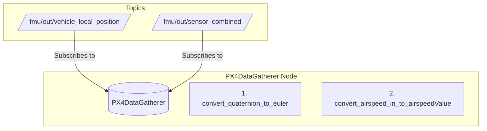

# vtol_ctrl_ros2

## Reading the README.md
This tutorial expects that the user (you) is (are) using VSCode to edit code and view the text. For GitHub or other sources, please adapt the startup instructions as needed. 
1. This Markdown Preview utilizes Mermaid and LaTeX in its setup so ROS graphs can be quickly and directly be altered later. Download the ```Markdown Preview Mermaid Support``` and the `Markdown+Math` extensions.
## Running the code
### Set up 
1. After downloading all the relevant files and variables as described in https://docs.px4.io/main/en/ros2/user_guide.html, start the "XRCE-DDS" agent (aka the "Mircro-ROS" agent) with settings for connecting to the uXRCE-DDS client running on the simulator:
```
MicroXRCEAgent udp4 -p 8888
``` 
2. In a new termianl, start the latest PX4 Gazebo simulation of preference as described in https://docs.px4.io/main/en/sim_gazebo_gz/. 

3. Start up QGroundControl, which should connect automatically to the PX4 Gazebo Simulation.

4. Open a new terminal for the ROS 2 source code. On Linux, this can be accomplished via the `Ctrl-Alt-t` keystroke sequence.


### To run the code
This will occupy the unused terminal described above. For each successive node started, a new terminal will be needed, and steps 1-4 will need to be repeated for each.

0. Make sure ROS 2 is completely installed. For our purposes, the installation instructions on PX4's website will do:
```
https://docs.px4.io/main/en/ros2/user_guide.html
```
Then:

1.  
```
cd ~/vtol_ctrl_ros2
```
2. Source the ROS 2 setup. WARNING: Please do this on Ubuntu 22.04 (the one with the jellyfish. For the Hackathon 2024, that's what the RPi has).
```
source /opt/ros/humble/setup.bash
```
Explanation for this is found at:
```
https://docs.ros.org/en/humble/Tutorials/Beginner-CLI-Tools/Configuring-ROS2-Environment.html
```
3. Source the install package; all the stuff is already set up.
```
source install/local_setup.bash
```
4. 
To use a certain node, run:
```
ros2 run <package-name> <package-node>
```
For the self-made nodes, this will currently either be:

```
ros2 run ros2_px4_interface offboard_test
```
or:
```
ros2 run ros2_px4_interface ros2_px4_interface
```


You can run multiple ROS nodes in different terminals. Make sure in each terminal, you source ROS and the install as described above.


NOTE: if you are going to alter the nodes, you need to update the package:
```
colcon build --packages-select ros2_px4_interface
```

The ```px4_ros_com``` and ```px4_msgs``` are provided by PX4 and should not be altered.

## Adding new nodes

If you are going to write a new node, follow the instructions found at Steps 2 on https://docs.ros.org/en/humble/Tutorials/Beginner-Client-Libraries/Writing-A-Simple-Py-Publisher-And-Subscriber.html


#### The full state needed:
##### Important note: The timestamp of the pixhawk is in [MICROseconds](https://docs.px4.io/main/en/msg_docs/VehicleAttitude.html#:~:text=system%20start%20(-,microseconds,-)%0A%0Auint64%20timestamp_sample).
| Abbreviation         | Name             | Frame Needed     | PX4/DDS Topic                                                                                                 | Given Frame in PX4/DDS Topic                                                                                                                                                                           | Needed Variable                                                                                                                   |
|----------------------|------------------|------------------|---------------------------------------------------------------------------------------------------------------|---------------------------------------------------------------------------------------------------------------------------------------------------------------------------------------------------|-----------------------------------------------------------------------------------------------------------------------------------|
| Va                   | Airspeed         | --               | (not available currently; need direct connection and separate ROS node)                                        | --                                                                                                                                                                                                | --                                                                                                                               |
| p,q,r                | Angular Velocity | Body             | [VehicleOdometry](https://docs.px4.io/main/en/msg_docs/VehicleOdometry.html)                                  | Body.<br> See [Angular Velocity Documentation](https://docs.px4.io/main/en/msg_docs/VehicleOdometry.html#:~:text=float32%5B3%5D%20angular_velocity).   | float32[3] angular_velocity<br>**Angular velocity in body-fixed frame (rad/s). NaN if invalid/unknown**                        |
| Vx, Vy, Vz           | Velocity         | Inertial         | [VehicleOdometry](https://docs.px4.io/main/en/msg_docs/VehicleOdometry.html).<br> Also available in [VehicleLocalPosition](https://docs.px4.io/main/en/msg_docs/VehicleLocalPosition.html) | Inertial or Body.<br> See [Velocity Documentation](https://docs.px4.io/main/en/msg_docs/VehicleOdometry.html#:~:text=uint8%20VELOCITY_FRAME_UNKNOWN%20%20%3D,invalid/unknown) | float32[3] velocity<br>**Velocity in meters/sec. Frame of reference defined by velocity_frame variable. NaN if invalid/unknown** |
| $\alpha$             | Angle of Attack  | --               | (not available currently; need to create ROS Node to calculate this)                                          | --                                                                                                                                                                                                | --                                                                                                                               |
| $\beta$              | Sideslip Angle   | --               | (not available currently; need to create ROS Node to calculate this)                                          | --                                                                                                                                                                                                | --                                                                                                                               |
| Px, Py, Pz           | Position         | Inertial         | [VehicleOdometry](https://docs.px4.io/main/en/msg_docs/VehicleOdometry.html).<br> Also available in [VehicleLocalPosition](https://docs.px4.io/main/en/msg_docs/VehicleLocalPosition.html) | Inertial.<br> NOTE: Needed to calculate roll, pitch and yaw ($\phi$, $\theta$, $\psi$) from Quaternion. May also have roll, pitch and yaw ($\phi$, $\theta$, $\psi$) in other topic.<br> See [Position Documentation](https://docs.px4.io/main/en/msg_docs/VehicleOdometry.html#:~:text=uint8%20POSE_FRAME_UNKNOWN%20%3D%200%0Auint8%20POSE_FRAME_NED,value%20NaN%20if%20invalid/unknown) | float32[3] position<br>**Position in meters. Frame of reference defined by local_frame. NaN if invalid/unknown**             |
| Ax, Ay, Az           | Acceleration     | Inertial         | [SensorCombined](https://docs.px4.io/main/en/msg_docs/SensorCombined.html)                                   | Inertial.<br> See [Acceleration Documentation](https://docs.px4.io/main/en/msg_docs/SensorCombined.html#:~:text=int32%20accelerometer_timestamp_relative%20%20%23%20timestamp,period%20in%20microseconds) | float32[3] accelerometer_m_s2<br>**Average value acceleration measured in the FRD body frame XYZ-axis in m/s²**                  |
| $\phi$, $\theta$, $\psi$ | Attitude         | Vehicle          | (not directly available. Must be calculated from quaternion in [VehicleOdometry](https://docs.px4.io/main/en/msg_docs/VehicleOdometry.html)) | --                                                                                                                                                                                                | float32[4] q<br>**Quaternion rotation from FRD body frame to reference frame. First value NaN if invalid/unknown**             |


The needed calculation will be performed in real time from [example code found on Wikipedia and converted to Python code.](https://en.wikipedia.org/wiki/Conversion_between_quaternions_and_Euler_angles#:~:text=%23define%20_USE_MATH_DEFINES%0A%23include,angles%3B%0A%7D) This calculation will be included in the subscriber function found in the px4_data_gatherer.py function.


### Current Plan for nodes (add to top as plan):

#### Nodes to be added:
- ROS wrapper for Dean's code
- Airspeed direct-to-USB 

#### Topics to be added:
- Airspeed_USB-to-Data_gatherer topic
- 
#### Graph

